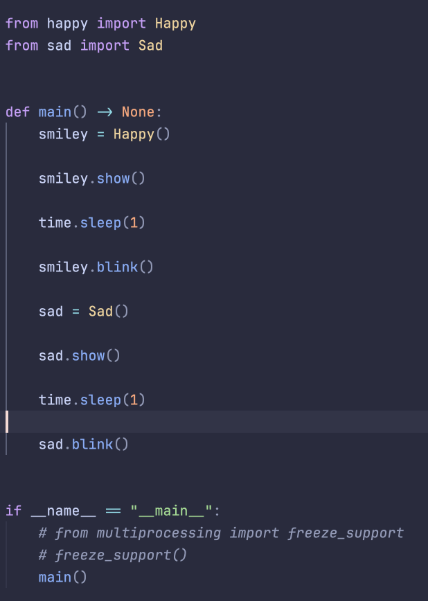
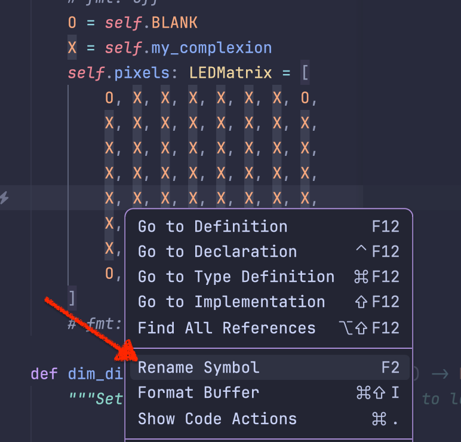

# Evidence and Knowledge

This document includes instructions and knowledge questions that must be completed to receive a *Competent* grade on this portfolio task.

## 1. Required evidence

### 1.1. Answer all questions in this document

- Each answer should be complete, well-articulated, and within the specified word count limits (if added) for each question.
- Please make sure **all** external sources are properly cited.
- You must **use your own words**. Please include your full chat transcripts if you use generative AI in any way.
- Generative AI hallucinates, is not an authoritative source

### 1.2. Make all the required modifications to the code

- Please follow the instructions in this document to make the changes needed to the code.

- When requested to upload evidence, upload all screenshots to `screenshots/` and embed them in this document. For example:

```markdown

```


> Note the `!`, and the use of a relative path.

- You must upload the code into your GitHub repository.
- While you can use a branch, your code should be in main when you submit.
- Upload a zip of this repository to Blackboard when you are ready to submit.
- You will be notified of your result via Blackboard
- However, if using GitHub classrooms, you may also receive additional feedback on GitHub directly

### 1.3. Optional: Use of Raspberry Pi and SenseHat

Raspberry Pi or SenseHat is **optional** for this activity. You can use the included `sense_hat.py` file to simulate the SenseHat on your computer.

If you use a Pi, please **delete** the `sense_hat.py` file.

### 1.4. Accessible version of the code

This project relies on visual patterns that appear on an LED matrix. If you have any accessibility requirements, you can use the `udl/accessible` branch to complete the project. This branch provides an accessible code version that uses text-based patterns instead of visual ones.

Please discuss this with your lecturer before using that branch.

## 2. Specific Tasks & Questions

Address the following tasks and questions based on the code provided in this repository.

### 2.1. Set up the project locally

1. Fork this repository (if not using GitHub Classrooms)
2. Clone your repository locally
3. Run the project locally by executing the `main.py` file
4. Evidence this by providing screenshots of the project directory structure and the output of the `main.py` file


If you are running on a Raspberry Pi, you can use the following command to run the project and then screenshot the result:

```bash
ls
python3 main.py
```

### 2.2. Fundamental code comprehension

 Answer each of the following questions **as they relate to that code** supplied by in this repository (ignore `sense_hat.py`):

1. Examine the code for the `smiley.py` file and provide  an example of a variable of each of the following types and their corresponding values (`_` should be replaced with the appropriate values):

  | Type                    | name       | value          |
  | ------------------------| ---------- | -------------- |
  | built-in primitive type | dimmed     | Bool           |
  | built-in composite type | pixels     | List of tuples |
  | user-defined type       | sense_hat  | SenseHat object|

2. Fill in (`_`) the following table based on the code in `smiley.py`:

  | Object                   | Type                    |
  | -------------------------| ------------------------|
  | self.pixels              | list                    |
  | A member of self.pixels  | tuple                   |
  | self                     | Smiley                  |

3. Examine the code for `smiley.py`, `sad.py`, and `happy.py`. Give an example of each of the following control structures using an example from **each** of these files. Include the first line and the line range:

   | Control Flow | File       | First line                | Line range                |
   | ------------ | ---------- | -----------               | -----------               |
   |  sequence    | happy.py   | line 36                   | line 40                   |
   |  selection   | sad.py     | line 24                   | line 27                   |
   |  iteration   | sad.py     | line 14                   | line 15                   |

4. Though everything in Python is an object, it is sometimes said to have four "primitive" types. Examining the three files `smiley.py`, `sad.py`, and `happy.py`, identify which of the following types are used in any of these files, and give an example of each (use an example from the code, if applicable, otherwise provide an example of your own):

| Type  | Used?  | Example |
|-------|--------|---------|
| int   | pixel  | See code example below |
| float | delay  | See code example below |
| str   | *      | See code example below |
| bool  | wide_open | See code example below |

**int example:**
```py
# Excerpt from: class Sad > def draw_mouth
mouth: list[int] = [49, 54, 42, 43, 44, 45]
for pixel in mouth:
    self.pixels[pixel] = self.BLANK
```

**float example:**
```py civ-ipriot-smiley/happy.py:31-38
# Excerpt from: class Happy
# uses a float value for the delay in the blink method where 0.25 is 0.25 seconds of default delay
    def blink(self, delay: float = 0.25) -> None:
        """Blinks the smiley's eyes once.

        :param delay: Delay between blinks (in seconds)
        """
        self.draw_eyes(wide_open=False)
        self.show()
        time.sleep(delay)
```

**str example:**
- todo


**bool example:**
```py civ-ipriot-smiley/sad.py:17-28
# Excerpt from: class Sad > def draw_eyes
# uses an if statement to determine if the eyes should be wide open or not using a the bool value `wide_open`
    def draw_eyes(self, wide_open: bool = True) -> None:
        eyes = [10, 13, 18, 21]
        for pixel in eyes:
            if wide_open:
                eyes = self.BLANK
            else:
                eyes = self.YELLOW
            self.pixels[pixel] = eyes
```


5. Examining `smiley.py`, provide an example of a class variable and an instance variable (attribute). Explain **why** one is defined as a class variable and the other as an instance variable.

> Your answer here
> 1. An example of a class variable inside the Smiley class would be WHITE. This means that every child class that inherits WHITE would have the same definition between the classes, as this would make sense, as the RGB value of white is pretty universal, and re-implementing this WHITE constant would be redundant code.
> 2. An example of an instance variable in the Smiley class would be the self.pixels attribute, as self.pixels  is initialized in the constructor (__init__) method of Smiley and takes in a value of self, which would/could be unique to each instance of Smiley that is made or inherited.


6. Examine `happy.py`, and identify the constructor (initializer) for the `Happy` class:
   1. What is the purpose of a constructor (in general) and this one (in particular)?

   > Your answer here
   > A constructor is a special method that is called when an object is created. This allows code to run when the object is created, usually to set up the initial attributes of the object. In the Happy class, the constructor is used to set up the starting state of the class by calling self.draw_mouth() and self.draw_eyes(), which ensures that the GUI state is correct before trying to modify it.

   2. What statement(s) does it execute (consider the `super` call), and what is the result?

   > Your answer here:
   > The super function allows a child class to call its inherited parent methods. In this instance, it calls the constructors of the parent classes, Smiley and Blinkable. The Smiley class has a constructor that initializes the SenseHat() object, which controls the GUI and all initializations, and it also initializes self.pixels, which is a state of the GUI represented by at least a list of tuples. Blinkable is an abstract class and doesn't include a constructor. Lastly, as described in the answer to the previous question, self.draw_mouth() and self.draw_eyes() ensure that the GUI state is correct before trying to modify it.

### 2.3. Code style

1. What code style is used in the code? Is it likely to be the same as the code style used in the SenseHat? Give two reasons as to why/why not:

> Your answer here
> The code style of object-oriented programming (OOP) is used in the happy.py file. It is very likely that SenseHat would also be OOP, as when importing and using that library, like in the example of the 'Smiley' class constructor, SenseHat() is an object which is then assigned to the variable 'self.sense_hat' and not a function. This would make it highly likely that the rest of the coding style within the module is also OOP.

2. List three aspects of this convention you see applied in the code.

> Your answer here
> Inheritance (which is found in the function signature of the Happy Class), Abstraction (which is found in the uses of an abstract class with abstract methods in the Blinkable Class ), Polymorphism (which is shown in the two different implementation happy and Sad classes which both use the Smiley interface)

3. Give two examples of organizational documentation in the code.

> Your answer here
> 1. the main.py script employs a module level docstring that describes the purpose that the main.py script serves and also some extra info for the developer that can't be easily inferred from the code itself
> 2. the smiley.py files employs doc-string on all of its public methods, as well as its purpose in the doc-string it also documents the parameters of the methods, which makes the methods feel less like a black box.

### 2.4. Identifying and understanding classes

> Note: Ignore the `sense_hat.py` file when answering the questions below

1. List all the classes you identified in the project. Indicate which classes are base classes and which are subclasses. For subclasses, identify all direct base classes.

  Use the following table for your answers:

| Class Name | Super or Sub? | Direct parent(s)   |
| ---------- | ------------- | ----------------   |
| Smiley     | Super         | None               |
| Sad        | Sub           | Smiley             |
| Blinkable  | Super         | None               |
| Happy      | Sub           | Smiley, Blinkable  |

2. Explain the concept of abstraction, giving an example from the project (note "implementing an ABC" is **not** in it self an example of abstraction). (Max 150 words)

> Your answer here
>

3. What is the name of the process of deriving from base classes? What is its purpose in this project? (Max 150 words)

> Your answer here
> The process of deriving from base classes is called inheritance. Its purpose in this project is to enable code reuse and define shared interfaces for related classes such as Happy and Sad classes that share the same interface of the Smiley class, this means we don't have to re-implement the functionality of Smiley when creating child classes

### 2.5. Compare and contrast classes

Compare and contrast the classes Happy and Sad.

1. What is the key difference between the two classes?
   > Your answer here
   > 1 - Happy inherits from both Smiley and Blinkable, while Sad does not
   > 2 - Happy implements the blink() method
   > 3 - The mouth variable inside the draw_mouth() method has different integer values between the classes
   > 4 - draw_eyes() in Sad has a different implementation and a different function signature as it also takes a boolean parameter as well as self

2. What are the key similarities?
   > Your answer here
   > 1 - Both classes inherit from the Smiley parent class
   > 2 - Both classes implement draw_mouth and draw_eyes methods
   > 3 - Both classes call super() from their parent classes and then call the self.draw_mouth() and self.draw_eyes() methods in the constructor

ds out the most to you and why?
   > Your answer here
   > The difference that stands out the most to me is that Happy inherits from both Smiley and the Blinkable classes. This stands out to me because Blinkable is an abstract class with an abstract method, meaning Happy should implement those abstract methods because it inherits from Blinkable.

4. How does this difference affect the functionality of these classes?
   > Your answer here
   >

### 2.6. Where is the Sense(Hat) in the code?

1. Which class(es) utilize the functionality of the SenseHat?
   > Your answer here
   >The Smiley class is the class the directly interacts with the functionality of SenseHat, the Sad and Happy class inherits the Smiley abstraction which allows the to in-directly interact with the SenseHat's functionality

2. Which of these classes directly interact with the SenseHat functionalities?
   > Your answer here
   > Only the Smiley class directly interacts with the functionality of SenseHat

3. Discuss the hiding of the SenseHAT in terms of encapsulation (100-200 Words)
   > Your answer here
   > Instead of inheriting the SenseHat class whenever we want to use it in a child class, we init it to the self.sense_hat attribute inside the Smiley class. This encapsulates it inside the Smiley class and allows us to have an intermediate level of control of how to use the SenseHats APIs, as it has to go through the Smiley class. This means there is a single point to use its APIs, which can help stop data races and undefined behaviour.

### 2.7. Sad Smileys Can’t Blink (Or Can They?)

Unlike the `Happy` smiley, the current implementation of the `Sad` smiley does not possess the ability to blink. Let's first explore how blinking has been implemented in the Happy Smiley by examining the blink() method, which takes one argument that determines the duration of the blink.

**Understanding Blink Mechanism:**

1. Does the code's author believe that every `Smiley` should be able to blink? Explain.

> Your answer here
> No, as the Smiley class does not inherit from the Blinkable class or have a blink() method in Smiley. the classes that want to implement the blink() method inherit both Blinkable and Smiley as separate abstractions

2. For those smileys that blink, does the author expect them to blink in the same way? Explain.

> Your answer here
> No, as well, the Blinkable abstract class, which has the abstract method called blink(), is only a structural abstract method and does not make the child classes that inherit it implement the logic of the method in a certain way. only that the child class implements the function signature of the abstract method.

3. Referring to the implementation of blink in the Happy and Sad Smiley classes, give a brief explanation of what polymorphism is.

> Your answer here
> Polymorphism allows objects of different classes to be treated as objects of a common parent class. Happy and Sad classes inherit from Smiley and override the draw_eyes method to provide their only logical implementations. This means there are both children of the Smiley interface but can have different effects / logic when used, even though they implement the same structure.

4. How is inheritance used in the blink method, and why is it important for polymorphism?

> Your answer here
> Inheritance is used in the blink method by defining it as an abstract method in the abstract base class Blinkable. This ensures that any child class inheriting from Blinkable must implement its own version of the blink method. this is important for polymorphism as it allows objects of different child classes Sad, Happy to be treated as instances of the Blinkable

1. **Implement Blink in Sad Class:**

   - Create a new method called `blink` within the Sad class. Ensure you use the same method signature as in the Happy class:

   ```python
   def blink(self, delay=0.25):
       pass  # Replace 'pass' with your implementation
   ```

2. **Code Implementation:** Implement the code that allows the Sad smiley to blink. Use the implementation from the Happy Smiley as a reference. Ensure your new method functions similarly by controlling the blink duration through the `delay` argument.

3. **Testing the Implementation:**

- Test the new blink functionality on your Raspberry Pi or within the Python classes provided. You might need to adjust the `main.py` script to incorporate Sad Smiley's new blinking capability.

Include a screenshot of the sad smiley or the modified `main.py`:



- Observe and document the Sad smiley as it blinks its eyes. Describe any adjustments or issues encountered during implementation.

  > in main when creating a new sad object it open's a separate gui window instead of writing over the current window but this could be intended behaviour, its just not what i was expecting from the SenseHat implementation

  ### 2.8. If It Walks Like a Duck…

  Previously, you implemented the blink functionality for the Sad smiley without utilizing the class `Blinkable`. Assuming you did not use `Blinkable` (even if you actually did), consider how the Sad smiley could blink similarly to the Happy smiley without this specific class.

  1. **Class Type Analysis:** What kind of class is `Blinkable`? Inspect its superclass for clues about its classification.

     > Blinkable is an Abstract base class

  2. **Class Implementation:** `Blinkable` is a class intended to be implemented by other classes. What generic term describes this kind of class, which is designed for implementation by others? **Clue**: Notice the lack of any concrete implementation and the naming convention.

  > there is no logic implementation in Blinkable's methods just a function signature and a decorator indicating its a abstract method, this show its an Abstract class

  3. **OO Principle Identification:** Regarding your answer to question (2), which Object-Oriented (OO) principle does this represent? Choose from the following and justify your answer in 1-2 sentences: Abstraction, Polymorphism, Inheritance, Encapsulation.

  > This represents Polymorphism. By defining a common interface (blink method) that a child class must implement, any child class that inherits Blinkable can be treated as instances of the Blinkable

  4. **Implementation Flexibility:** Explain why you could grant the Sad Smiley a blinking feature similar to the Happy Smiley's implementation, even without directly using `Blinkable`.

  > You can give the Sad Smiley a blinking feature without using Blinkable because Python supports duck typing and does not force the dev to implement an abstract class for a class to add a method

  5. **Concept and Language Specificity:** In relation to your response to question (4), what is this capability known as, and why is it feasible in Python and many other dynamically typed languages but not in most statically typed programming languages like C#? **Clue** This concept is hinted at in the title of this section.

  > Your answer here

  ***

  ## 3. Refactoring

  ### 3.1. Does a Smiley Have to Be Yellow?

  While our current implementation predominantly features yellow smileys, emotional expressions like sickness or anger typically utilize colors like green, red, or orange. We'll explore the feasibility of integrating these colors into our smileys.

  1. **Defined Colors and Their Location:**

     1. Which colors are defined and in which class(s)?
        > Your answer here
        > the colours define are white, green, red, yellow, Blank(black). They are defined in the Smiley class as class variables.
     2. What type of variables hold these colors? Are the values expected to change during the program's execution? Explain your answer.
        > Your answer here:
        > The colors are defined as class variables, which means they are shared across all instances of the Smiley class. also given the pep8 naming convention these variables are constants, meaning they are not expected to change during the program's execution.

     3. Add the color blue to the appropriate class using the appropriate format and values.

  2. **Usage of Color Variables:**

     1. In which classes are the color variables used?
        > Your answer here
        > The color variables are used in the Smiley class and its subclasses, Sad and Happy.

  3. **Simple Method to Change Colors:**
  4. What is the easiest way you can think to change the smileys to green? Easiest, not necessarily the best!
     > Your answer here
     > The easiest way to change the smileys to green would be to directly replace all instances of self.YELLOW with self.GREEN in the code.

  Here's a revised version of the "Flexible Colors – Step 1" section for the smiley project, incorporating your specifications for formatting and content updates:

  ### 3.2. Flexible Colors – Step 1

  Changing the color of the smileys once is straightforward, but it isn't very flexible. To facilitate various colors for smileys, it is advisable not to hardcode values in any class. This approach was identified earlier as a necessary change. Let's start by removing the built-in assumptions about color in our classes.

  1. **Add a method called `complexion` to the `Smiley` class:** Implement this instance method to return `self.YELLOW`. Using the term "complexion" instead of "color" provides a more abstract terminology that focuses on the meaning rather than implementation.

  2. **Refactor subclasses to use the `complexion` method:** Modify any subclass that directly accesses the color variable to instead utilize the new `complexion` method. This ensures that color handling is centralized and can be easily modified in the future.

  3. **Determine the applicable Object-Oriented principle:** Consider whether Abstraction, Polymorphism, Inheritance, or Encapsulation best applies to the modifications made in this step.

  4. **Verify the implementation:** Ensure that the modifications function as expected. The smileys should still display in yellow, confirming that the new method correctly replaces the direct color references.

  This step is crucial for setting up a more flexible system for color management in the smiley display logic, allowing for easy adjustments and extensions in the future.

  ### 3.3. Flexible Colors – Step 2

  Having removed the hardcoded color values, we now enhance the base class to support dynamic color assignments more effectively.

  1. **Modify the `__init__()` method in the `Smiley` class:** Introduce a default argument named `complexion` and assign `YELLOW` as its default value. This allows the instantiation of smileys with customizable colors.

  2. **Introduce a new instance variable:** Create a variable called `my_complexion` and assign the `complexion` parameter to it. This step ensures that each smiley instance can maintain its own color state.

  3. **Rationale for `my_complexion`:** Using a distinct instance variable like `my_complexion` avoids potential conflicts with the method parameter names and clarifies that it is an attribute specific to the object.

  4. **Bulk rename:** We want to update our grid to use the value of complexion, but we have so many `Y`'s in the grid. Use your IDE's refactoring tool to rename all instances of the **symbol** `Y` to `X`. Where `X` is the value of the `complexion` variable. Include a screenshot evidencing you have found the correct refactor tool and the changes made.

  

  5. **Update the `complexion` method:** Adjust this method to return `self.my_complexion`, ensuring that whatever color is assigned during instantiation is what the smiley displays.

  6. **Verification:** Run the updated code to confirm that Smileys still defaults to yellow unless specified otherwise.

  ### 3.4. Flexible Colors – Step 3

  With the foundational changes in place, it's now possible to implement varied smiley colors for different emotional expressions.

  1. **Adjust the `Sad` class initialization:** In the `Sad` class's initializer method, change the superclass call to include the `complexion` argument with the value `self.BLUE`, as shown:

     ```python
     super().__init__(complexion=self.BLUE)
     ```

  2. **Test color functionality for the Sad smiley:** Execute the program to verify that the Sad smiley now appears blue.

  3. **Ensure the Happy smiley remains yellow:** Confirm that changes to the Sad smiley do not affect the default color of the Happy smiley, which should still display in yellow.

  4. **Design and Implement An Angry Smiley:** Create an Angry smiley class that inherits from the `Smiley` class. Set the color of the Angry smiley to red by passing `self.RED` as the `complexion` argument in the superclass call.

  ***
